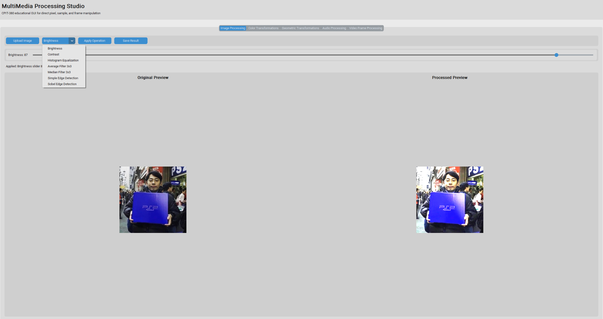
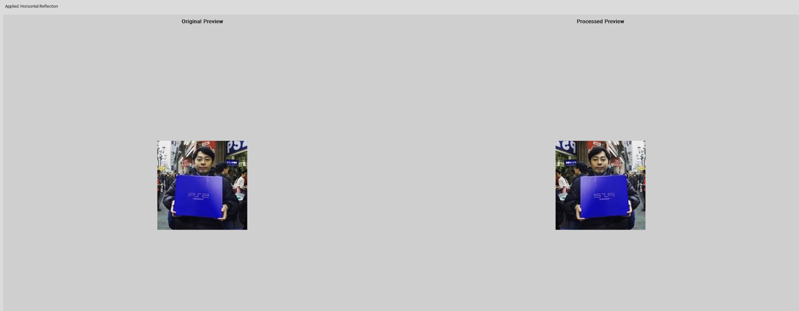

# MultiMedia Processing Studio

MultiMedia Processing Studio is an educational desktop application built with Python and CustomTkinter for CPIT-380 Multimedia Technologies.

It allows users to process images, audio files, and videos through a simple GUI. The project demonstrates multimedia concepts using manual pixel, sample, and frame manipulation.

## Features

- Image processing: brightness, contrast, histogram equalization, average filter, median filter, and edge detection
- Color transformations: grayscale, sepia, negative, and posterization
- Geometric transformations: rotation, reflection, scaling, center crop, and custom crop
- Audio processing: volume adjustment, normalization, reverse, and splice/cut
- Video frame processing: apply selected image operations frame by frame
- Original and processed preview with save output option

## Project Screenshots

The following screenshots show the main features of the MultiMedia Processing Studio application.

### Image Processing

#### Brightness Adjustment


#### Contrast Adjustment


#### Histogram Equalization


#### Sobel Edge Detection


### Color Transformations

#### Grayscale


#### Negative


#### Posterization


### Geometric Transformations

#### Rotate 180


#### Horizontal Reflection

## Technologies Used

- Python
- CustomTkinter
- Pillow
- NumPy
- wave module
- PyDub
- OpenCV
- FFmpeg

## How To Run

Install the required libraries:

```bash
pip install -r requirements.txt
```
Run the application:

```bash
python main.py
```

## Notes

- WAV files work directly using Python's built-in `wave` module.
- MP3 support may require FFmpeg.
- Video processing depends on OpenCV codec support.
- OpenCV is used for reading and writing video files, while the main processing operations are implemented manually.
